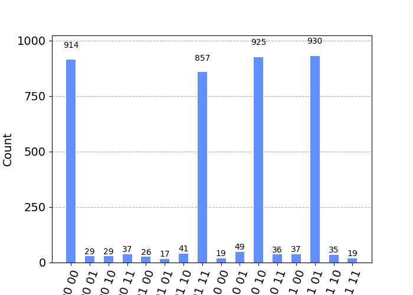
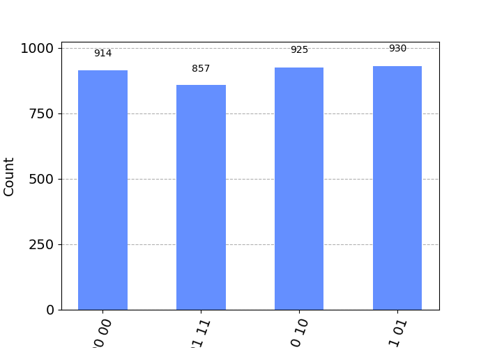
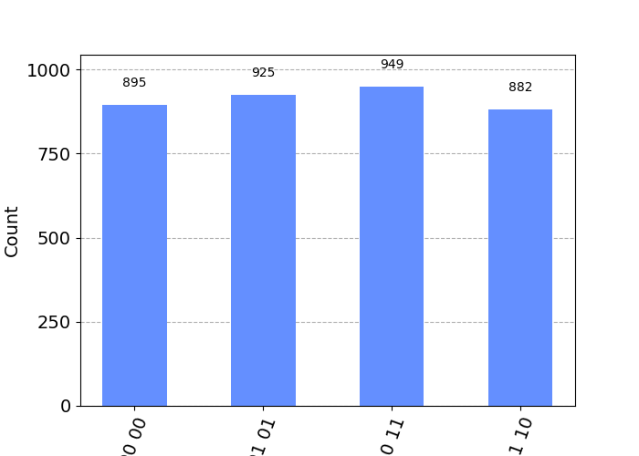

# Testing Quantum Phase Kickback effect

In an ideal classical computing world, if a single bit manipulates another bit, the control bit is unaffected, but the target bit is modified depending on the control bit.

But in the quantum world, things aren't so simple. Unlike regular notion, the target bit and the control bit both affect each other. One of the implication of such effect is known as the quantum phase kickback effect.

And one of the implication of the quantum phase kickback effect is the reversal of roles of control and target bits under the Hadamard Gates.

***We can use hadamard gates to reverse the effects of control and target bits.***

Let us take an example of the following operation.

$B_1$ = $B_1$ XOR $B_0$

| $B_0$ initial | $B_1$ initial | $B_0$ final |  $B_1$ final |
|---------------|--------------:|------------:|-------------:|
|    0          |     0         |           0 |            0 |  
|    0          |     1         |           0 |            1 |  
|    1          |     0         |           1 |            1 |  
|    1          |     1         |           1 |            0 |  

We don't need to state that $B_0$ remains unchanged by the operation.

There is quantum equivalent of this gate calleld the C-NOT gate. When the qubits have the definite state, they work identical to the previous operation.

Let us take this quantum circuit of the normal operation.

We can see the output in simulation as well as in the real quantum comptuer as:

 In the simulation.

 In the Quantum Comptuer.

 Filtered quantum computer result

Interpretation:

    00 00
    01 11
    10 10
    11 01
    || ||
    || |+-- the final state of B0
    || +--- the final state of B1
    ||
    ||
    |+----- the initial state of B0
    +------ the initial state of B1

In the truth table below, ordering is changed.

The two MSB's were the initial measurementes, and the two LSB's were the final measurements.

| $Q_0$ initial | $Q_1$ initial | $Q_0$ final |  $Q_1$ final |
|---------------|--------------:|------------:|-------------:|
|    0          |     0         |           0 |            0 |  
|    0          |     1         |           0 |            1 |  
|    1          |     0         |           1 |            1 |  
|    1          |     1         |           1 |            0 |  

All of these were as expected.

### Quantum Phase Kickback effect

But if we hadamard the inputs, then use the circuit, and hadamard the results, the casuality of the bits are reversed.

Circuit for demonstration of result of quantum phase kickback.

On simulating first, and later simulating on the quantum computer,

Simulation

Computation in quantum computer

Filtered quantum output.

Interpretation:

    00 00
    01 01
    10 11
    11 10
    || ||
    || |+-- the final state of B0
    || +--- the final state of B1
    ||
    ||
    |+----- the initial state of B0
    +------ the initial state of B1

In the truth table below, ordering is changed.

The two MSB's were the initial measurementes, and the two LSB's were the final measurements.

| $Q_0$ initial | $Q_1$ initial | $Q_0$ final |  $Q_1$ final |
|---------------|--------------:|------------:|-------------:|
|    0          |     0         |           0 |            0 |  
|    0          |     1         |           1 |            1 |  
|    1          |     0         |           1 |            0 |  
|    1          |     1         |           0 |            1 |  

We can see that the roles of the qubits are reversed under these conditions. This is the quantum effect.

(I still have much to learn.)
