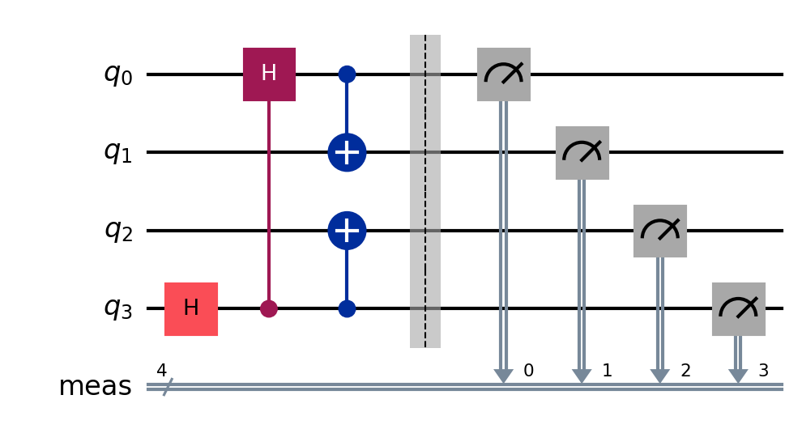
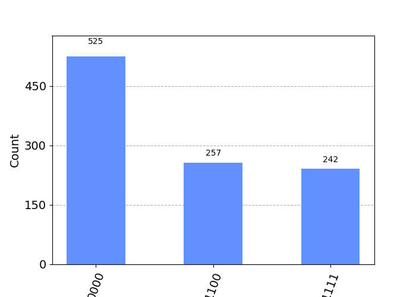
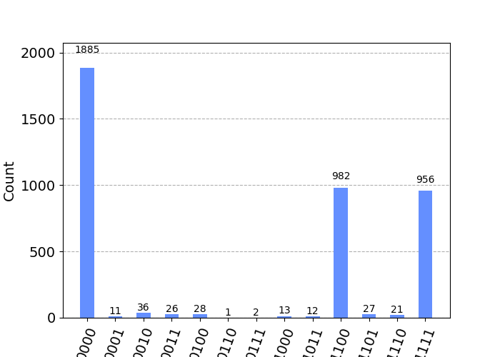
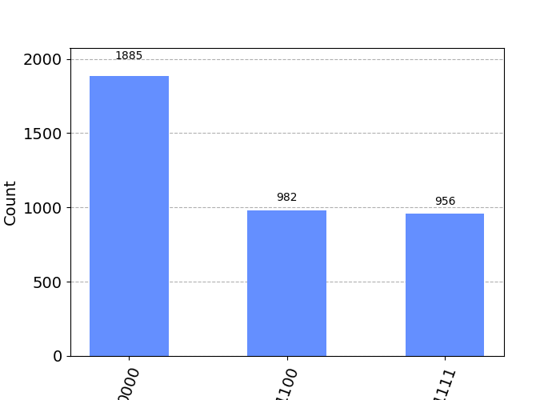

# quantum-computing

This is me dabbling into some quantum realm, playing with the qubits and observing the results.

I have used the following libraries:

    qiskit: For the creation of quantum circuit and its simulation.
####
    qiskit_ibm_provider: In order to interface with the real quantum computer provided by the IBM.

Similarly I've used following helper functions:

    qiskit.tools.visualization.plot_histogram: To plot the histogram.
####
    pprint: For pretty printing some lists. I can look for the items more easily when printed more prettily.
####
    qiskit.tools.monitor: To see the status of job I sent over to the quantum computer of IBM.

## Example

I've simulated and tested the folowing circuit in [this file](Quantum-world.ipynb)

When simulating using the AER's backend ('qasm_simulator'), I got following output, which is as expected:

But when simulating using the real quantum computing, some extra noise did affect the results. It is also expected since the quantum computers of present are not perfect devices. This is the output I got.

After filtering out the noise, (removing the results whose count did not meet the threshold of 50, for 4000 simulations) I got the following result.

Overall it was fun doing this exercise. I got to know so much about the quantum mechanics, and how quantum computing works.